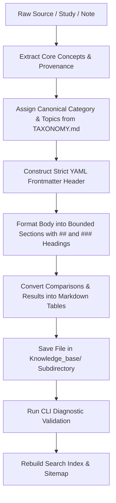

# Knowledge Base Source Formatting Skill

## Goal

Transform raw endurance training articles, research papers, newsletters (e.g. Knowledge is Watts), study notes, or guides into curated, structured Markdown sources ready for ingestion into the repository's Knowledge Base (`Knowledge_base/`).

Every produced document must strictly satisfy:
1. The **Canonical Frontmatter Contract** (matching `Knowledge_base/TAXONOMY.md` and `validator.py`).
2. The **Retrieval & Chunker Structure** (clean Markdown headers `##`, bounded sections of ~100–450 words, pipe tables, zero broken relative links).
3. The **Evidence-Grounded Content Standard** (factual, scientific, zero hallucinations, precise wattage/lactate/VO2 parameters).

---

## 1. Canonical Frontmatter Contract

Every Knowledge Base source must start on line 1 with a YAML frontmatter header enclosed by `---`.

### Standard Frontmatter Schema

```yaml
---
title: "Precise, Descriptive Document Title"
language: en
category: <canonical_category>
topics:
  - <Canonical_Topic_1>
  - <Canonical_Topic_2>
source: "Origin URL, journal, newsletter, or publication name"
author: "Author, lead researcher, or organization"
date: "YYYY-MM-DD"
summary: "One or two faithful, concise English sentences summarizing the core finding or concept."
key_takeaways:
  - "Directly supported practical takeaway or empirical finding 1"
  - "Directly supported practical takeaway or empirical finding 2"
---
```

### Field Specification & Rules

| Field | Type | Requirement | Rules & Constraints |
| :--- | :--- | :--- | :--- |
| `title` | `string` | **Required** | Clear, unquoted or double-quoted title without markdown formatting. |
| `language` | `string` | **Required** | Must be exactly `en`. All sources must be in English. |
| `category` | `string` | **Required** | Must be strictly one of the 7 predefined categories below. |
| `topics` | `list[str]` | **Required** | YAML list of 1–5 canonical topics using exact spelling and casing from `TAXONOMY.md`. |
| `source` | `string` | **Required** | Exact origin (URL, newsletter name, podcast, or journal citation). Do not use placeholders. |
| `author` | `string` | **Required** | Author(s), researcher(s), or publishing entity. |
| `date` | `string` | **Required** | Exact publication date in ISO format `YYYY-MM-DD`. Do not invent dates. |
| `summary` | `string` | **Required** | 1–2 faithful English sentences (under 300 characters, no quotes escaping issues). |
| `key_takeaways` | `list[str]` | *Optional* | Curated bullet points directly grounded in the source's empirical findings. |

> [!IMPORTANT]
> Never include passage chunk IDs, word counts, or file paths in the YAML frontmatter. These are derived dynamically during index synchronization.

---

## 2. Canonical Taxonomy Reference

Only use the exact category and topic names below. Never introduce custom or near-synonym tags.

### Categories & Allowed Topics

1. **`metrics`** (Core physiological metrics, testing methodologies, intensity domains)
   - `FTP`
   - `CP`
   - `W_prime`
   - `VO2max`
   - `FatMax`
   - `LT1_VT1`
   - `LT2_VT2`
   - `Durability`
   - `Power_vs_HR`
   - `Heart_rate_variability`

2. **`hiit`** (High-Intensity Interval Training protocols and session design)
   - `Short_intervals` (e.g. 30s/15s, 40s/20s)
   - `Long_intervals` (e.g. 4x8min, 4x4min, 4x16min)
   - `Decreasing_intervals` (front-loaded / decreasing duration)
   - `Fast_start_intervals` (accelerating VO2 kinetics)
   - `Progressive_overload`

3. **`zone2`** (Sub-threshold aerobic base and physiological adaptations)
   - `Aerobic_base`
   - `Fat_oxidation`
   - `Mitochondrial_density`
   - `Lab_vs_field`

4. **`strength`** (Resistance and strength training for endurance athletes)
   - `Heavy_torque` (low cadence / high torque cycling)
   - `Periodization`
   - `Unilateral`
   - `Sprint_performance`

5. **`nutrition`** (Ergogenic aids, fueling strategies, nutrition periodization)
   - `Sodium_bicarbonate`
   - `Beta_alanine`
   - `Carbohydrate_ratio`
   - `Antioxidants`
   - `Underfueling_REDs`
   - `Ergogenic_aids`

6. **`physiology`** (Biological mechanisms and environmental factors)
   - `Cardiac_hypertrophy` (stroke volume & eccentric remodeling)
   - `Lactate_shuttle` (MCT1/MCT4 transporters)
   - `Temperature_effects` (heat stress, thermoregulation, sex differences)
   - `Underfueling_REDs`

7. **`periodization`** (Macrocycle, mesocycle, and microcycle planning)
   - `Block_periodization`
   - `Double_threshold` (Norwegian subthreshold model)
   - `Cross_training` (Modality transfer, cross-discipline substitution)
   - `Microcycles`
   - `TTA_TTE` (Time-to-exhaustion)
   - `Volume_quantification` (TSS, work in zones, kJ)
   - `Heart_rate_variability`

---

## 3. Document Body & Retrieval Optimization

The search engine splits Markdown documents into **Evidence Passages** along section boundaries (`## ` and `### `). To ensure high-quality retrieval:

### Heading Hierarchy & Section Bounds
- Start the body with `# <Document Title>` matching frontmatter.
- Add provenance block: `**Source:** ... **Date:** ... **Author:** ...` followed by `---`.
- Use `## ` for major logical sections (e.g., Background, Study Design, Mechanisms, Practical Takeaways).
- Keep each section focused and bounded between **100 and 450 words**. Sections under 100 words may be coalesced; sections over 450 words are forcibly split.
- Subdivide detailed topics with `### ` subheadings rather than massive prose blocks.

### Tables & Data Representation
- Format tabular data using standard Markdown pipe tables:
  ```markdown
  | Group / Metric | Baseline | Post-Intervention | Net Change (%) |
  | :--- | :--- | :--- | :--- |
  | 4x8min Group | 52.8 ml/kg/min | 58.3 ml/kg/min | +10.4% |
  ```
- Keep tables intact and clean; do not split tables across random text fragments.

### Tone, Precision & Evidence Grounding
- **Factual & Empirical:** Preserve exact physiological metrics (e.g., `% VO2max`, `mMol/L lactate`, `% FTP`, `W/kg`, cadence `rpm`).
- **No Conversational Noise:** Remove podcast banter, promotional remarks, or unverified claims.
- **Actionable Coaching Rules:** Group practical advice into explicit bullet points or numbered checklists.
- **Valid Links Only:** If adding relative markdown links, ensure the target file exists. Broken relative links fail validation audits.

---

## 4. End-to-End Creation Workflow

Follow these steps whenever creating or formatting a Knowledge Base document:



### Step 1: Extract Metadata & Classify
1. Determine exact publication date (`YYYY-MM-DD`), source URL/publication, and author.
2. Select the single best matching **category** from the 7 canonical options.
3. Select 1 to 4 relevant **topics** using exact naming from `TAXONOMY.md`.
4. Write a 1–2 sentence English `summary`.

### Step 2: Structure Content with Templates
Choose the appropriate reference template:
- For scientific papers, empirical studies, or research reviews: use [references/article-template.md](references/article-template.md).
- For concept guides, testing protocols, or training methodologies: use [references/topic-guide-template.md](references/topic-guide-template.md).
- For podcast transcripts or Q&A mailbags: use `.agents/transcript-to-episode-note/`.

### Step 3: Determine Destination Path
Save new files following the established repository directory hierarchy:
- Articles / Studies: `Knowledge_base/Articles/<Source_Or_Author>/<category>/<descriptive-slug>.md`
- Podcast Guides: `Knowledge_base/Episodes/<Podcast_Name>/<category>/<descriptive-slug>.md`

*Example:* `Knowledge_base/Articles/knowledgeIsWatts/hiit/hiit-fast-start-intervals-vo2-kinetics.md`

### Step 4: Validate & Sync Index
Always verify and synchronize immediately after writing the file:

```bash
# 1. Run diagnostic validation on the new source
python3 main/cli.py validate --source "Articles/<Source>/<category>/<filename>.md"

# 2. Rebuild index and master sitemap
python3 main/cli.py build-index

# 3. Test retrieval via CLI
python3 main/cli.py search "<key concept query>"
```

---

## 5. Common Anti-Patterns to Avoid

| Anti-Pattern | Why It Fails | Correct Approach |
| :--- | :--- | :--- |
| `category: "vo2max"` | Invalid category (category must be `hiit`, `metrics`, etc.) | Use `category: "hiit"` and `topics: ["VO2max"]`. |
| `topics: ["4x8 intervals", "VO2 Max"]` | Non-canonical topic names | Use exact `topics: ["Long_intervals", "VO2max"]`. |
| `date: "November 2024"` | Invalid date format | Use ISO `date: "2024-11-05"`. |
| `language: "English"` or missing | Validator enforces `en` | Use exact `language: en`. |
| Giant 1000-word unbroken section | Chunker forcibly splits into fragments | Subdivide with `## ` and `### ` headers (~150–350 words). |
| Broken relative link `[see here](../guide.md)` | Fails validator diagnostic audit | Use valid relative path or remove placeholder link. |
| Hallucinating numbers or physiological claims | Compromises knowledge base reliability | Only retain findings explicitly presented in the source. |
