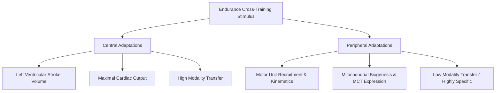

# VO2max Interval Training: Bike vs. Run Cross-Training Adaptations

**Source:** Systematic Reviews, Meta-Analyses & Empirical Trials (Menges et al. 2026, Tanaka 1994, Millet et al. 2009)  
**Author:** Menges et al., Millet et al., Gibala et al.  
**Date:** 2026-05-25  

---

## Central vs. Peripheral Adaptation Framework

Endurance exercise adaptations operate across two distinct physiological compartments: central cardiovascular capacity and peripheral muscular oxidative potential. As established by Clausen (1977), central adaptations—comprising left ventricular eccentric remodeling, increased stroke volume, and total maximal cardiac output—represent a generic cardiovascular stimulus that transfers between exercise modalities. In contrast, peripheral muscular adaptations—including capillary density, mitochondrial biogenesis, and monocarboxylate transporter expression (MCT1 and MCT4; Dubouchaud et al. 2000, Burgomaster et al. 2007)—are localized to the specific motor units, joint kinematics, and contraction dynamics recruited during the movement.

According to the interval programming framework developed by Buchheit & Laursen (2013), the primary stimulus for central cardiorespiratory development is accumulating time at or above ~90% of maximal oxygen uptake ($T@\text{VO}_2\text{max}$). While cycling and running both allow athletes to reach this intensity domain, differences in muscle mass engagement, eccentric versus concentric loading, and pulmonary ventilation create distinct physiological and performance adaptations.

---

## Systematic & Narrative Reviews of Cross-Training

The efficacy of cross-training between running and cycling has been evaluated through meta-analyses and classical narrative reviews spanning four decades of experimental research.

### Summary of Systematic and Narrative Reviews

| Review & Methodology | Study Scope | Key Outcomes & Effect Sizes | Conclusion & Transferability |
| :--- | :--- | :--- | :--- |
| **Menges et al. (2026)** *(Systematic Review & Meta-Analysis)* | 7 RCTs (n = 11–40 per study) comparing run-only vs. cycle-only interventions | • Treadmill $\text{VO}_2\text{max}$: Hedges' $g = -0.32$ ($95\%\text{ CI } -0.76\text{ to } 0.13, p = 0.16$) • Ergometer $\text{VO}_2\text{max}$: $g = -0.34$ ($95\%\text{ CI } -0.79\text{ to } 0.11, p = 0.14$) • Running race performance: $g = 0.02$ ($p = 0.88$) | Substituting running with cycling yields neither clear improvements nor decrements over short-to-moderate training blocks. Modality interchangeability cannot be assumed. |
| **Tanaka (1994)** *(Narrative Review)* | Narrative review on run, cycle, and swim cross-training | • Partial transfer of $\text{VO}_2\text{max}$ gains across modes • Asymmetrical transfer dynamics | $\text{VO}_2\text{max}$ transfer is more pronounced when running serves as the cross-training stimulus. Cross-training adaptations never exceed sport-specific training gains. |
| **Loy, Hoffmann & Holland (1995)** *(Narrative Review)* | Narrative review on athletes vs. recreational cohorts | • Modest fitness transfer in untrained individuals • Lack of foundational evidence in elite cohorts | Cross-training maintains general aerobic fitness in recreationally active athletes. No founding research supports cross-training benefits in elite athletes, and authors noted it may be neutral or even detrimental at the elite level. |

---

## Modality Specificity & Physiological Mechanisms

Comparative physiological analyses by Millet, Vleck & Bentley (2009) highlight several fundamental differences between cycling and running mechanics that dictate training transfer:

### Physiological & Biomechanical Differences

- **$\text{VO}_2\text{max}$ Specificity:** Pure runners typically record higher $\text{VO}_2\text{max}$ values on a treadmill than on a cycle ergometer due to greater active muscle mass. Conversely, well-trained cyclists achieve near-identical $\text{VO}_2\text{max}$ on both ergometer and treadmill, while triathletes exhibit intermediate values.
- **Asymmetric Transfer:** Running elicits greater central and peripheral transfer to cycling than cycling does to running. The eccentric loading and higher whole-body metabolic demand of running transfer more readily to non-weight-bearing cycling.
- **Submaximal Thresholds vs. $\text{VO}_2\text{max}$:** Submaximal parameters (such as the ventilatory threshold and lactate threshold) can adapt independently of $\text{VO}_2\text{max}$, showing pronounced mode-specific improvement (often with larger submaximal shifts observed in cycling).
- **Neuromuscular & Fatigue Profiles:** Running induces substantial eccentric muscle action, generating higher muscle damage, central fatigue, and prolonged strength deficits. Cycling is purely concentric, producing localized peripheral muscular fatigue with minimal structural muscle fiber breakdown.

---

## Original Run–Cycle Cross-Training Interventions

Empirical randomized controlled trials have directly quantified cross-training transfer across distinct training blocks and competitive phases.

### Key Randomized Controlled Trials

| Study | Cohort & Duration | Training Protocol | Primary Findings & Outcomes |
| :--- | :--- | :--- | :--- |
| **Pechar et al. (1974)** | Healthy adults; RCT; dual-mode testing | Running vs. cycling training | Treadmill $\text{VO}_2\text{max}$: Run group $+7.1\%$, Cycle group $+2.7\%$. Ergometer $\text{VO}_2\text{max}$: Cycle group $+7.7\%$, Run group $+6.8\%$. Run-to-cycle transfer exceeded cycle-to-run transfer. |
| **Magel et al. (1975)** | Recreational swimmers; 10 weeks | Swim interval training | Swim $\text{VO}_2\text{max}$ increased by $+380\text{ ml/min}$ ($p < 0.05$); treadmill $\text{VO}_2\text{max}$ remained unchanged. Sport specificity is also evident in elite cohorts: swimmers recorded $\text{VO}_2\text{max}$ of $58.4\text{ ml/kg/min}$ swimming vs. $51.3$ cycling, whereas triathletes reached $53.0$ swimming vs. $68.2$ cycling (BJSM). |
| **Mutton et al. (1993)** | Moderately fit runners (baseline $\text{VO}_2\text{max} \sim 55.2$); 5 weeks | Run-only vs. combined cycle/run at 85–90% HRmax | Treadmill $\text{VO}_2\text{max}$ improved equally in both groups (Run: $55.3 \rightarrow 58.2$; Cycle/Run: $55.6 \rightarrow 58.9\text{ ml/kg/min}$). 5,000m and 1,609m time-trial performance improved identically. |
| **Hoffmann et al.** | 16 healthy men; 4 sessions/week | Run vs. cycle training | Treadmill $\text{VO}_2\text{max}$ improved significantly across both training cohorts. |
| **Paquette et al.** | 31 male cross-country runners; 4 weeks | Run vs. cycle training | 3,000m time-trial performance improved equally across both cohorts. |
| **Ruby et al. (1996)** | 18 untrained females; 10 weeks | 70–80% heart rate reserve running vs. cycling | Treadmill $\text{VO}_2\text{max}$ improved similarly in both groups (run group $+6.5\%$). |
| **White et al. (2003)** | 11 female collegiate runners; 5 weeks | 50% run volume replaced by cycling on alternate days during recuperative phase (between XC and track) | 3,000m run times slowed slightly in both groups (Run: $+1.4\%$ / $9\text{s}$; Cross-training: $+3.4\%$ / $22\text{s}$) with no significant change in estimated $\text{VO}_2\text{max}$. Authors concluded cycling cross-training **adequately maintained** aerobic performance during post-season recuperation comparable to run-only training. |

---

## Interval Training & Skeletal Muscle Metabolic Adaptations

High-intensity interval training (HIIT) and sprint interval training (SIT) trigger profound intramuscular adaptations that underpin endurance capacity across modalities:

### Key Molecular, Enzymatic & Transporter Adaptations

- **Mitochondrial Biogenesis Signaling:** MacInnis & Gibala (2017) demonstrated that exercise intensity is the primary driver of cellular signaling cascades (AMPK, p38 MAPK, PGC-1$\alpha$) stimulating mitochondrial biogenesis. Work-matched comparisons indicate interval protocols often stimulate greater increases in mitochondrial protein content than moderate-intensity continuous training (MICT).
- **Rapid Enzymatic Remodeling:** Gibala & McGee (2008) showed that six interval sessions over 2 weeks (~15 minutes of total intense exercise, ~600 kJ total work) significantly elevate skeletal muscle oxidative potential and endurance performance.
- **Enzyme Kinetics and Glycogen Sparing:** Burgomaster et al. (2005, 2008) and Gibala et al. (2006) established that low-volume sprint intervals double cycling endurance time at ~80% $\text{VO}_2\text{peak}$, increase maximal citrate synthase (CS) activity by $+38\%$, elevate resting muscle glycogen by $+26\%$, and yield comparable cytochrome c oxidase expression to traditional high-volume base training (~2.5 hours vs. ~10.5 hours total time).
- **Monocarboxylate Transporter Dynamics:** Dubouchaud et al. (2000) demonstrated that endurance training increases total muscle MCT1 expression by $+90\%$. Burgomaster et al. (2007) showed that SIT elevates MCT4 after 1 and 6 weeks, while MCT1 increases after 6 weeks of training, with adaptations reversing following 6 weeks of detraining.

---

## Acute Modality Comparisons: Cycling, Flat & Uphill Running

Acute exercise responses differ significantly between flat running, uphill running, and cycle ergometry during matched high-intensity interval bouts.

### Acute Physiological Responses Across Modalities

| Parameter / Condition | Flat Running HIIT (1% Incline) | Uphill Running HIIT (8% Incline) | Cycling Ergometer HIIT |
| :--- | :--- | :--- | :--- |
| **Time $\ge 90\% \text{ VO}_2\text{max}$** | Baseline (6.4 min in 4x5min protocol) | **$+42\%$ increase** (9.1 min in 4x5min protocol at 8% grade per Held et al. 2023) | Lower time $>90\% \text{ VO}_2\text{max}$ compared to running at matched relative intensity |
| **Mean Oxygen Uptake ($\text{VO}_2$)** | High | Maximal ($\text{VO}_2\text{peak}$ and $\text{VO}_2\text{mean}$ significantly elevated) | Lower absolute $\text{VO}_2$ (ES = 1.46 vs. running) |
| **Heart Rate Response** | High | Maximal | Lower peak HR (ES = 1.53 vs. running) |
| **Ground Reaction Forces (GRF)** | High impact; higher eccentric joint loading | **$22–39\%$ reduction** in impact GRF at 6–9% slopes (Gottschall & Kram 2005) | Zero impact; purely concentric force application |
| **Muscular Contraction Profile** | Mixed stretch-shortening cycle (concentric + eccentric) | Concentric-dominant muscular action; mechanical bridge to cycling | Purely concentric force generation |
| **Neuromuscular Load** | Moderate localized leg load; high systemic impact fatigue | Moderate impact; high metabolic load | High localized peripheral leg fatigue; lower central cardiovascular demand |

Inline speed skating cross-training research by Stangier et al. (2016) demonstrated that 8 weeks of running or cycling training yielded equal $+17\%$ gains in sport-specific $\text{VO}_2\text{peak}$ (sprint/endurance-capacity study), with the running group developing higher reliance on fat oxidation post-intervention.

---

## Practical Coaching & Cross-Training Prescription Rules

To optimize central cardiovascular adaptation while managing musculoskeletal stress, coaches and athletes can apply the following guidelines:

### Direct Evidence-Based Applications
1. **Recuperative Phase Cross-Training:** During transitional or post-season phases between competitive blocks, substituting 50% of running volume with cycling on alternate days preserves aerobic fitness and $\text{VO}_2\text{max}$ while giving the musculoskeletal system relief from repetitive running impacts (White et al. 2003).
2. **Cardiorespiratory Maximization via Incline:** For runners seeking to maximize time at near-maximal oxygen uptake ($T@\text{VO}_2\text{max}$) while reducing orthopedic load, 8% uphill intervals provide a $+42\%$ longer duration $\ge 90\% \text{ VO}_2\text{max}$ with 22–39% lower ground-reaction impact forces than flat running (Held et al. 2023, Gottschall & Kram 2005).

### Coaching Practice & Practical Extrapolations
*(The following guidelines represent coaching heuristics derived from physiological mechanisms rather than direct RCT endpoints)*:
- **Interval Power Targets on the Bike:** When substituting running HIIT sessions on the bicycle to maintain central cardiac output without orthopedic pounding, cycling intervals at 105–110% FTP (e.g., 4x4min to 4x8min with 2–3 min recovery) provide sufficient stimulus to reach $>90\% \text{ HRmax}$.
- **Pre-Competition Specificity Window:** In the 4–6 weeks preceding peak goal competitions, cross-training volume should be tapered down in favor of sport-specific training to ensure neuromuscular coordination, running economy, and sport-specific motor unit firing patterns are fully optimized.

---

## References

1. Menges T, et al. Cross-training between running and cycling: effects on VO2max and running performance — a systematic review and meta-analysis. *Frontiers in Sports and Active Living*. 2026;DOI:10.3389/fspor.2026.1843803.
2. Tanaka H. Effects of cross-training. Transfer of training effects on VO2max between cycling, running and swimming. *Sports Medicine*. 1994;18(5):330–339. PMID:7871294.
3. Loy SF, Hoffmann JJ, Holland GJ. Benefits and practical use of cross-training in sports. *Sports Medicine*. 1995;19(1):1–8. PMID:7740244.
4. Millet GP, Vleck VE, Bentley DJ. Physiological differences between cycling and running. *Sports Medicine*. 2009;39(3):179–206. PMID:19290675.
5. Clausen JP. Effect of physical training on cardiovascular adjustments to exercise in man. *Physiological Reviews*. 1977;57(4):779–815. PMID:333481.
6. Buchheit M, Laursen PB. High-intensity interval training, solutions to the programming puzzle: Part I & II. *Sports Medicine*. 2013;43(5):313–338, 43(6):427–454. PMID:23539308, 23832851.
7. Pechar GS, McArdle WD, Katch FI, Magel JR, DeLuca J. Specificity of cardiorespiratory adaptation to bicycle and treadmill training. *Journal of Applied Physiology*. 1974;36(6):753–756.
8. Magel JR, et al. Specificity of swim training on maximum oxygen uptake. *Journal of Applied Physiology*. 1975;38(1):151–155. PMID:1110232.
9. Schneider DA, et al. Maximum oxygen uptake and ventilatory threshold during swimming, cycling, and running in swimmers and triathletes. *British Journal of Sports Medicine*. PMC1725090.
10. Mutton DL, et al. Effect of run vs. combined cycle/run training on VO2max and running performance. *Medicine & Science in Sports & Exercise*. 1993;PMID:8107548.
11. Hoffmann JJ, et al. Cycle vs. run training and cardiorespiratory adaptations. (Included in Menges et al. 2026 meta-analysis).
12. Paquette et al. Comparison of running and cycling training on cross-country runners. (Included in Menges et al. 2026 meta-analysis).
13. Ruby BC, et al. Cross-training: effects on aerobic capacity and performance. *Medicine & Science in Sports & Exercise*. 1996. (Included in Menges et al. 2026 meta-analysis).
14. White JA, et al. Effectiveness of cycle cross-training between competitive seasons in female distance runners. *Journal of Strength and Conditioning Research*. 2003;17(2):319–323. PMID:12741870.
15. MacInnis MJ, Gibala MJ. Physiological adaptations to interval training and the role of exercise intensity. *Journal of Physiology*. 2017;595(9):2915–2930. PMID:27748956.
16. Gibala MJ, McGee SL. Metabolic adaptations to short-term high-intensity interval training. *Exercise and Sport Sciences Reviews*. 2008;36(2):58–63. PMID:18362686.
17. Burgomaster KA, et al. Six sessions of sprint interval training increases muscle oxidative potential and cycle endurance capacity in humans. *Journal of Applied Physiology*. 2005;98(6):1985–1990.
18. Burgomaster KA, et al. Divergent response of metabolite transport proteins in human skeletal muscle after sprint interval training and detraining. *American Journal of Physiology - Regulatory, Integrative and Comparative Physiology*. 2007;292(5):R1970–R1976.
19. Burgomaster KA, et al. Similar metabolic adaptations during exercise after low-volume sprint interval and traditional endurance training in humans. *Journal of Physiology*. 2008;586(1):151–160.
20. Gibala MJ, et al. Short-term sprint interval versus traditional endurance training: similar initial adaptations in human skeletal muscle and exercise performance. *Journal of Physiology*. 2006;575(3):901–911.
21. Dubouchaud H, et al. Endurance training, expression, and physiology of LDH, MCT1, and MCT4 in human skeletal muscle. *American Journal of Physiology - Endocrinology and Metabolism*. 2000;278(4):E571–E579.
22. Held S, et al. Increased oxygen uptake in well-trained runners during uphill high-intensity running intervals: a randomized crossover testing. *Frontiers in Physiology*. 2023;14:1117314.
23. Gottschall JS, Kram R. Ground reaction forces during downhill and uphill running. *Journal of Biomechanics*. 2005;38(3):445–452.
24. Stangier C, et al. Effects of cycling versus running training on sprint and endurance capacity in inline speed skating. *Journal of Sports Science & Medicine*. 2016;15:41.
25. Stangier C, et al. Effects of cycling vs. running training on endurance performance in preparation for inline speed skating. *Journal of Strength & Conditioning Research*. 2016;30(6):1597–1606.
26. Buchheit M, et al. The physiological, perceptual and neuromuscular responses to running versus cycling high-intensity interval training. *German National Library*. d-nb.info/1276481098/34.
