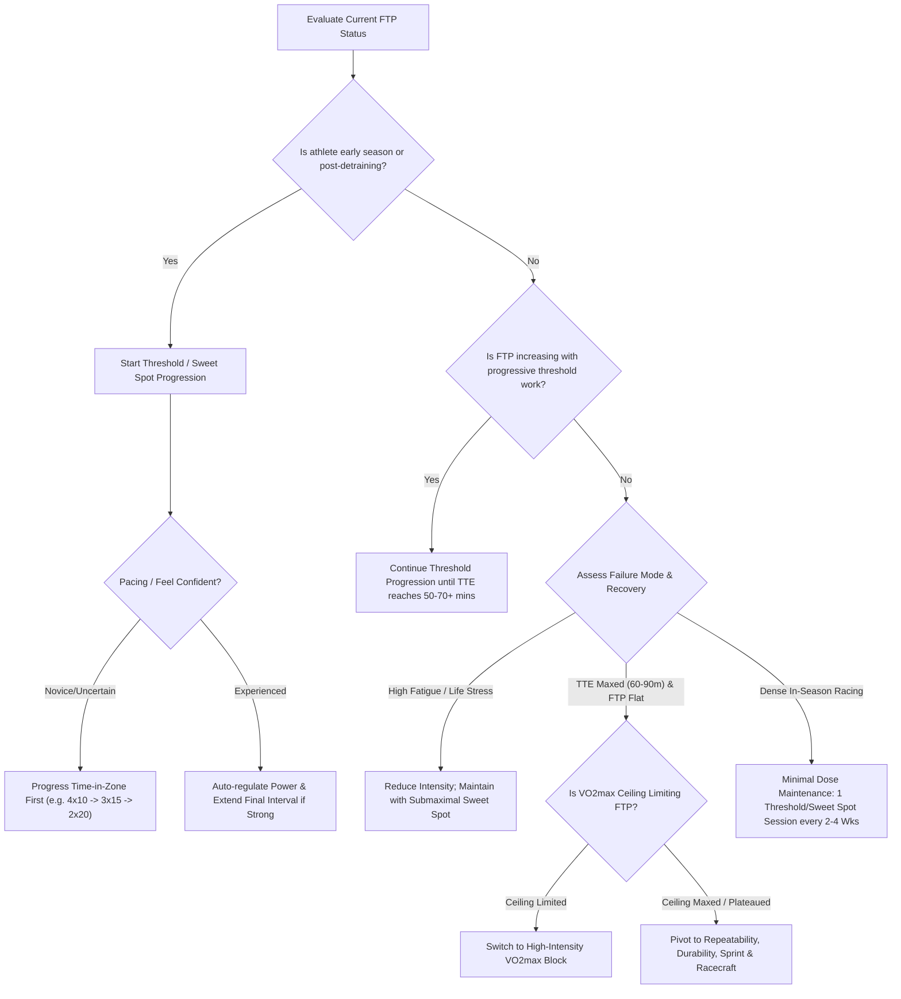

# FTP Training Decision Tree — Complete Guide

_Source: Empirical Cycling Podcast — Kolie Moore & Rory Porteous_

---

## What Is FTP and Why Does It Matter?

Functional Threshold Power (FTP) sets the upper limit for sustainable aerobic power production. It integrates central cardiovascular capacity ($\text{VO}_2\text{max}$) and peripheral muscular adaptations (oxidative capacity, capillary density, mitochondrial density, and lactate clearance).

### Why FTP Matters
- **Upper Limit of Aerobic Sustainability**: Power above FTP relies heavily on anaerobic capacity ($\text{W}'$) and causes rapid accumulation of fatigue metabolites, drastically shortening time-to-exhaustion (TTE).
- **Duration Expansion**: Elevating FTP or expanding TTE at a given power output converts short-duration efforts (e.g., 5-minute capacity) into sustainable 30–60+ minute efforts.
- **Central and Peripheral Integration**: FTP reflects how effectively the muscular system utilizes oxygen delivered by the central cardiovascular system. In untrained or returning athletes, leg muscle fatigue often limits FTP before central cardiac capacity is reached.

---

## Early Season vs. Late Season FTP Training

The strategy for FTP development changes substantially across a training macrocycle.

### Early Season Strategy
- **High Responsiveness**: Early in the season (or after a period of detraining), aerobic fitness responds rapidly to structured threshold and sweet spot training.
- **Time vs. Power Progression**:
  - **Novice / Pacing-Uncertain Athletes**: Prioritize **adding time in zone** before adding power. Overshooting power early in an interval block creates excessive fatigue that compromises subsequent workouts.
  - **Experienced Athletes**: Can auto-regulate wattage by feel during intervals (e.g., starting conservative on early sets and increasing power on final sets if feeling strong).
- **Auto-Regulation Framework**:
  - Example: A $4 \times 10\text{ min}$ progression starting at 240W can progress to $250\text{W}$, then extending the final interval to 15–20 minutes if legs and breathing allow.
  - Caution: Extending duration beyond planned targets is safer than over-powering intervals, as excessive power dips into anaerobic reserves and inflates recovery demands.

### Late Season Strategy
- **Plateau Recognition**: When progressive FTP workouts (e.g., $3 \times 20\text{ min}$, $2 \times 30\text{ min}$, $1 \times 60\text{ min}$) no longer yield higher FTP wattage, threshold-only training has hit diminishing returns.
- **TTE vs. FTP Ceiling**: Pushing threshold intervals past 60–90 minutes total time-in-zone builds muscular endurance (TTE) but will not raise the absolute FTP ceiling if $\text{VO}_2\text{max}$ is the bottleneck.
- **Pivot to Ceiling Expansion**: Once FTP plateaus, transition to high-intensity $\text{VO}_2\text{max}$ training to expand oxygen transport capacity and lift the ceiling for future FTP gains.

---

## Training History & Adaptation Expectations

An athlete's training history (years of structured, progressive training) dictates the rate and magnitude of FTP adaptations.

| Training History | Characteristics | Primary Training Stimulus | Expected Annual FTP Gains |
| :--- | :--- | :--- | :--- |
| **Developing ($< 1\text{–}2\text{ yrs}$)** | Rapid adaptation; large ceiling headroom; easy overload response. | Sweet spot, basic threshold progressions, moderate volume. | $+20\text{ to }+40\text{W}$ / year |
| **Intermediate ($2\text{–}4\text{ yrs}$)** | Steady progression; requires structured block periodization. | Mixed threshold extension, targeted $\text{VO}_2\text{max}$ blocks. | $+10\text{ to }+20\text{W}$ / year |
| **Experienced ($5+\text{ yrs}$)** | Fast return to baseline FTP; smaller ceiling headroom; higher overload required. | Specialized $\text{VO}_2\text{max}$ overload, extreme volume/doubles. | $+0\text{ to }+10\text{W}$ / year (or TTE focus) |

### Managing Experienced / Well-Trained Athletes
- **Rapid Baseline Recovery**: Experienced athletes regain prior-season FTP quickly with basic sweet spot/tempo work, but raising FTP past historical peaks requires substantial stimulus.
- **Higher Overload Requirement**: Small incremental overloads no longer suffice; highly trained athletes may require $\text{VO}_2\text{max}$ double days, high-volume blocks, or specialized microcycles.
- **Plateau Realism**: When an experienced athlete's FTP remains static for multiple seasons despite optimized training, rest, and stimulus variations:
  - Shift focus away from pushing absolute FTP power.
  - Direct training toward **durability / repeatability**, **sprint power**, **racecraft / tactics**, **short hill punch**, or **off-bike recovery (sleep, nutrition)**.

---

## Opportunity Cost & Training Priorities

Every training intervention carries an opportunity cost against other fitness phenotypes and recovery capacity.

### The LifeMax Constraint
- **Off-Bike Stress**: Work, family, sleep deprivation, and psychological stress reduce total adaptive capacity ("LifeMax").
- **Canary in the Coal Mine**: FTP intervals are sensitive indicators of systemic fatigue. When an athlete who normally completes $2 \times 20\text{ min}$ fails midway through the second interval, the cause is rarely lack of motivation—it is almost always accumulated fatigue, under-fueling, poor sleep, or life stress.

### Building an Athlete Priority List
Before designing an FTP block, rank training priorities based on race demands:

```
1. Target Demands (e.g., Criterium Repeatability vs. Ultra TTE)
2. Primary Bottleneck (e.g., Low FTP Ceiling vs. Short Hill Punch)
3. Secondary Attributes (e.g., Sprint Power, Fatigue Resistance)
4. Life & Recovery Limits (Available Time & Stress Capacity)
```

- **High-FTP Priority**: Ultra-distance racers, time trialists, long hill climb specialists.
- **Lower-FTP / Multi-Attribute Priority**: Criteriums, XCO mountain biking, road sprinters (where sprint repeatability, technical skills, and anaerobic punch often outweigh marginal FTP gains).

---

## The FTP Decision Tree

Use this decision matrix to determine the optimal training path based on current state and responses:



### Decision Summary Table

| Situation / Signal | Recommended Training Action | Key Rationale |
| :--- | :--- | :--- |
| **Early Season / Returning** | Progress duration ($3 \times 10 \to 3 \times 15 \to 2 \times 20$) at controlled intensity. | Establishes muscular baseline without excessive fatigue. |
| **FTP Rising Steady** | Keep pushing time-in-zone up to 60–90 min total. | Low-risk, effective progressive overload. |
| **FTP Plateaued + High TTE** | Switch to $\text{VO}_2\text{max}$ interval block (3–4 weeks). | Raises the central cardiovascular ceiling to allow FTP to rise. |
| **FTP Plateaued (Well-Trained)** | Focus on repeatability, sprint, tactics, or durability. | Avoids burnout chasing marginal/non-existent FTP power gains. |
| **In-Season / Dense Racing** | Maintenance dose: $1 \times$ sweet spot/threshold effort every 2–4 weeks. | Preserves aerobic adaptations while conserving freshness for races. |
| **High Life Stress / Low Sleep** | Submaximal sweet spot or auto-regulated open intervals. | Avoids digging a recovery hole during non-training stress spikes. |

---

## Key Execution & Monitoring Rules

1. **Time Progression Over Power Progression**: When in doubt, add duration to intervals before forcing higher target wattages.
2. **Auto-Regulation Framework**:
   - Allow experienced athletes to extend interval lengths when feeling exceptional (e.g., $1 \times \text{open-ended}$ interval).
   - If power starts dropping or heart rate decouples excessively due to heat/fatigue, truncate the session.
3. **Heat Management**: In hot or indoor conditions, shorten interval durations (e.g., $5 \times 10\text{ min}$ with rest instead of $2 \times 25\text{ min}$) to maintain power without heat-soaking the athlete.
4. **Submaximal Maintenance**: Maintenance does not require all-out TTE efforts. A 6–7/10 RPE sweet spot session effectively maintains aerobic adaptations during dense race blocks.

---

## Practical Edge Cases & Listener Q&A

### 1. Over-Under Intervals ($90\% / 105\%$ FTP)
- Over-unders are simply a variable-intensity subset of threshold training.
- Exact percentage ratios ($90\% / 105\%$) do not need strict rigidity.
- **Best Use Cases**: Gravel racing, variable terrain, or for athletes who struggle with flat, continuous indoor threshold power. Auto-regulating the "over" portion by feel is highly effective.

### 2. Interval Structure: $6 \times 10\text{ min}$ vs. $2 \times 30\text{ min}$ vs. $1 \times 60\text{ min}$
- Longer continuous intervals create sustained oxidative and metabolic stress (activating sirtuins and shifting $\text{NAD}^+/\text{NADH}$ ratios) beyond initial AMPK signaling.
- Rest intervals allow higher total time-in-zone.
- **Guideline**: Target intervals of at least 15 minutes duration once past initial conditioning. Ultra-short reductions (e.g., $60 \times 1\text{ min}$) fail to elicit the requisite oxidative stress for threshold development.

### 3. Theoretical Maximum Time-to-Exhaustion (TTE)
- For trained cyclists, the maximum sustainable TTE at true FTP is approximately **80 to 100 minutes**.
- Reports of 85–90 minute continuous threshold tests are seen primarily in specialized ultra-endurance athletes. Pushing beyond 100 minutes at true FTP is physiologically unfeasible due to motor unit fatigue and substrate depletion.

### 4. How to Know When $\text{VO}_2\text{max}$ Training Is Required to Lift FTP
- **Primary Signal**: Threshold intervals no longer increase FTP wattage despite adequate recovery and volume.
- **Note on Volume**: High training volume alone increases gross efficiency and durability, but will not raise $\text{VO}_2\text{max}$ or FTP ceilings in well-trained athletes without high-intensity cardiovascular stimulus.

### 5. In-Season Maintenance for XCO / Dense Racing Schedules
- XCO mountain biking requires high punchiness, technical capacity, and $\text{VO}_2$ repeatability; peak FTP is secondary.
- **Maintenance Strategy**: Include one moderate threshold/sweet spot workout every 2 to 4 weeks. Avoid attempting TTE progression during active racing blocks.

### 6. Can Fixed-Duration High-Frequency FTP Work Build TTE?
- **Question**: Does doing $2 \times 20\text{ min}$ four times a week without progression increase TTE?
- **Answer**: No. Without progressive duration or intensity overload, static submaximal intervals quickly lose adaptive stimulus once the muscles adapt to that specific workload.

---

## Decision Checklist

1. [ ] **Assess Seasonal Timing**: Is the athlete early build, mid-season peak, or in a dense racing block?
2. [ ] **Identify Bottleneck**: Has FTP power plateaued, or is TTE the primary limitation?
3. [ ] **Select Progression Axis**: Novice/uncertain $\to$ extend time first; Experienced $\to$ auto-regulate power & time.
4. [ ] **Evaluate Recovery & LifeMax**: Are life stress, sleep, or heat impacting interval execution?
5. [ ] **Determine Ceiling Need**: If FTP is flat after 4–6 weeks of structured threshold, schedule a 3–4 week $\text{VO}_2\text{max}$ block.
6. [ ] **Audit Opportunity Cost**: If training history is high and FTP gains are stalled, reallocate training volume toward sprint, durability, tactics, or racecraft.
