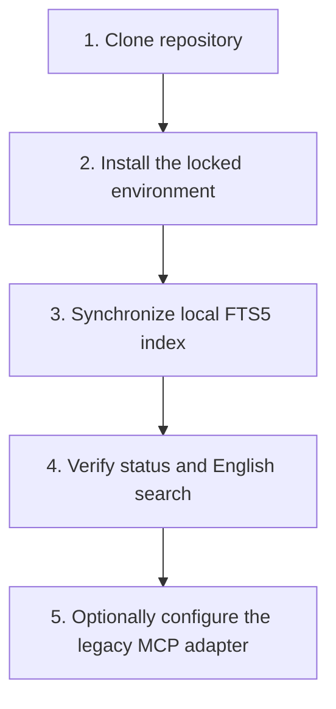

# Prototype Specification: Clone-to-First-Query Onboarding & Acceptance Checklist

**Document ID**: `docs/prototypes/009-clone-to-first-query-onboarding.md`
**Author**: `icaro-rdp`
**Date**: 2026-08-10
**Amended**: 2026-08-20
**Status**: Active baseline specification
**Target Issue**: [Issue #9](https://github.com/icaro-rdp/endurance_training/issues/9)

---

## 1. Executive Summary

This specification describes the active clone-to-first-query path for the English-only Endurance Training Knowledge Base. The current product builds a citation-stable SQLite FTS5 passage index, verifies it with a deterministic content fingerprint, and serves English lexical search without network access or model downloads.

Dense retrieval, reranking, and the final evidence-oriented MCP contract are not part of this onboarding flow. They remain deferred until an executable English benchmark supports them.

---

## 2. Prerequisites & Platform Support

### Supported Platforms

- **macOS**: Apple Silicon or Intel x86_64.
- **Linux**: A current distribution with Python and SQLite FTS5 support.
- **Windows**: Windows 11 through WSL2. Native Windows remains out of scope for the first release.

### Environment Prerequisites

- Python 3.10 or newer.
- SQLite with FTS5 and JSON1 enabled.
- `uv` for installation from the checked-in lockfile.
- Git 2.30 or newer.

---

## 3. Five-Step Onboarding Flow



### Step 1: Clone Repository

```bash
git clone https://github.com/icaro-rdp/endurance_training.git
cd endurance_training
```

### Step 2: Install the Locked Environment

Create the project environment from `pyproject.toml` and `uv.lock`, then verify
Python, PyYAML, SQLite FTS5, and SQLite JSON1:

```bash
uv sync --locked
uv run python --version
uv run python -c "import sqlite3, yaml; c=sqlite3.connect(':memory:'); c.execute('CREATE VIRTUAL TABLE smoke USING fts5(content)'); c.execute(\"SELECT value FROM json_each('[1]')\")"
```

No embedding, vector-store, or reranker package is installed by the active retrieval baseline. Dependency installation may contact the configured package registry; index construction and retrieval themselves do not use the network.

### Step 3: Explicit Corpus Synchronization

Build the structure-aware passage index and sitemap:

```bash
uv run endurance-kb build-index
```

The command parses English Markdown into Evidence Passages, creates the local FTS5 database at `main/.kb_index.sqlite`, stores the current content fingerprint, and rebuilds `Knowledge_base/INDEX.md`. It does not contact a model registry or download weights.

### Step 4: Verify Status and English Search

```bash
uv run endurance-kb status
uv run endurance-kb search "How should 4x8 minute VO2max intervals be structured?"
uv run endurance-kb search "FTP test protocol" --top 3 --format json
```

`status` must report `fresh`. Search returns passage-level results with section breadcrumbs and exact source line citations. If a Knowledge Source changes, search fails with `stale_index` until `build-index` is run again.

### Step 5: Optionally Configure the Legacy MCP Adapter

The existing `main.mcp_server` process can expose the current legacy tools to a local MCP client:

```json
{
  "mcpServers": {
    "endurance-kb": {
      "command": "/absolute/path/to/endurance_training/.venv/bin/python",
      "args": ["-m", "main.mcp_server"],
      "cwd": "/absolute/path/to/endurance_training",
      "env": {
        "PYTHONUNBUFFERED": "1"
      }
    }
  }
}
```

This adapter is not yet the final evidence-oriented MCP contract. Official SDK migration, structured tool errors, strict document containment, and the planned evidence tools remain release work.

---

## 4. Verification & Acceptance Checklist

| Verification Step | Command / Action | Expected Result |
| :--- | :--- | :--- |
| **1. Locked Installation** | `uv sync --locked` | The environment installs from the checked-in project metadata and lockfile. |
| **2. Test Suite** | `PYTHONDONTWRITEBYTECODE=1 uv run python -m unittest discover -s tests -v` | Chunking, synchronization, schema, retrieval, and facade tests pass. |
| **3. Offline Synchronization** | Run `uv run endurance-kb build-index` with network access disabled. | `main/.kb_index.sqlite` is created without a model download. |
| **4. Freshness Status** | `uv run endurance-kb status` | State is `fresh`; current and indexed fingerprints match. |
| **5. English CLI Search** | `uv run endurance-kb search "Zone 2 fat oxidation"` | Attributable English Evidence Passages are returned. |
| **6. Stale Error Guard** | Add, edit, rename, or remove a Knowledge Source, then query. | Search exits with `stale_index` and instructs the user to run `build-index`. |
| **7. No Implicit Rebuild** | Compare the database before and after a search. | Search does not change or replace the Derived Index. |

Final MCP Inspector, path-containment, cross-platform clean-install, and semantic-retrieval benchmark checks remain deferred acceptance items rather than claims of this increment.

---

## 5. Troubleshooting & Maintenance

- **`missing_index`**: Run `uv run endurance-kb build-index` before the first query.
- **`stale_index`**: Run `uv run endurance-kb build-index` after adding, editing, renaming, or deleting a Knowledge Source, or after changing `TAXONOMY.md`.
- **`invalid_index`**: Run `uv run endurance-kb build-index`; synchronization
  replaces the invalid database transactionally.
- **`invalid_index_path`**: Choose a nonsymlink `.sqlite`, `.sqlite3`, or `.db`
  path outside `Knowledge_base`.
- **`knowledge_base_not_found`**: Run from the repository root, set
  `ENDURANCE_KB_DIR`, or put global `--kb-dir /absolute/path/to/Knowledge_base`
  before the command.
- **`invalid_knowledge_base`**: Select the canonical `Knowledge_base` root that
  contains `TAXONOMY.md`, not one of its subdirectories.
- **`empty_corpus`**: Correct the selected Knowledge Base path or add a curated
  source before synchronizing.
- **`invalid_source`**: Fix the named source's YAML or ingestion metadata; the
  previous database is preserved.
- **`source_not_found`**: For targeted validation, use the exact case-sensitive
  `.md` path relative to `Knowledge_base/`.
- **`unsupported_language`**: Remove the non-English Knowledge Source from the
  curated corpus, or add a separately reviewed English source with established
  provenance. Do not translate evidence in place as an ingestion repair.
- **Offline Operation**: Once the locked environment is installed, index construction and retrieval need no network access.
