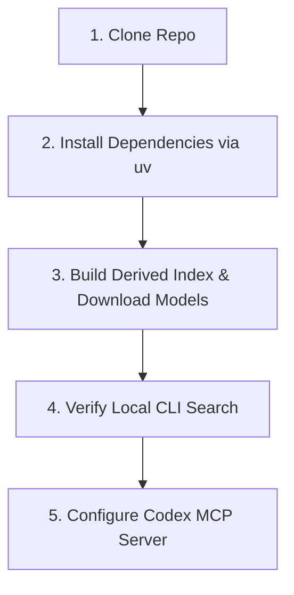

# Prototype Specification: Clone-to-First-Query Onboarding & Acceptance Checklist

**Document ID**: `docs/prototypes/009-clone-to-first-query-onboarding.md`  
**Author**: `icaro-rdp`  
**Date**: 2026-08-10  
**Status**: Complete / Prototype Specification  
**Target Issue**: [Issue #9](https://github.com/icaro-rdp/endurance_training/issues/9)  

---

## 1. Executive Summary

This prototype specification establishes the end-to-end onboarding experience for the **Endurance Training Knowledge Base**. It ensures a new developer or athlete can clone the repository on macOS (Apple Silicon / Intel), Linux, or Windows (via WSL2), install dependencies reproducibly, download local model weights once, build derived vector indexes, verify the search CLI, and configure an MCP client (Codex, Claude Desktop, Cursor) with zero undocumented local knowledge.

---

## 2. Prerequisites & Platform Support

### Supported Platforms
- **macOS**: Apple Silicon (M1/M2/M3) with MPS acceleration (recommended) or Intel x86_64.
- **Linux**: Ubuntu 22.04 LTS / Debian 12 / Fedora 39+ (CPU or CUDA).
- **Windows**: Windows 11 with WSL2 (Ubuntu 22.04 LTS recommended). *Native Windows is out of scope for initial release.*

### Environment Prerequisites
- Python $\ge$ 3.10 (3.12 recommended)
- `uv` package manager (`curl -LsSf https://astral.sh/uv/install.sh | sh`)
- Git $\ge$ 2.30

---

## 3. Five-Step Onboarding Flow



### Step 1: Clone Repository
```bash
git clone https://github.com/icaro-rdp/endurance_training.git
cd endurance_training
```

### Step 2: Install Reproducible Dependencies
Using `uv` to create a virtual environment and lock exact dependencies:
```bash
uv venv
source .venv/bin/activate
uv pip install -e .
```

### Step 3: Corpus Synchronization & Model Weights Download
Run explicit Corpus Synchronization to download `intfloat/multilingual-e5-base` and `BAAI/bge-reranker-base` local weights and generate the unified SQLite database (`main/.kb_index.sqlite`):
```bash
python3 main/cli.py build-index
```
> **Output**: Validates frontmatter, parses Markdown structure, generates 768-dim embeddings via PyTorch MPS/CPU, populates `main/.kb_index.sqlite`, and writes SHA-256 corpus hash.

### Step 4: Verify Search CLI
Test local hybrid search directly from the terminal in English or Italian:
```bash
# English Query (Diversified)
python3 main/cli.py search "How to structure 4x8min VO2max intervals?"

# Italian Query (Cross-Lingual)
python3 main/cli.py search "Come programmare il blocco di Allenamento a Soglia?"
```

### Step 5: Configure MCP Client (Codex / Claude Desktop / Cursor)

#### Codex / Claude Desktop Configuration (`mcpServers`)
Add the following to `~/.codex/mcp.json` or `claude_desktop_config.json`:
```json
{
  "mcpServers": {
    "endurance-kb": {
      "command": "/Users/icaroredepaolini/Personale/training/endurance_training/.venv/bin/python",
      "args": [
        "-m",
        "main.mcp_server"
      ],
      "cwd": "/Users/icaroredepaolini/Personale/training/endurance_training",
      "env": {
        "PYTHONUNBUFFERED": "1"
      }
    }
  }
}
```

---

## 4. Verification & Acceptance Checklist

To ensure clean-room installation reproducibility, every release must pass this checklist on a fresh clone:

| Verification Step | Command / Action | Expected Result | Pass/Fail |
| :--- | :--- | :--- | :---: |
| **1. Fresh Virtualenv** | `uv venv && source .venv/bin/activate` | Clean virtualenv created without error | $\square$ |
| **2. Zero Stale Imports** | `python3 main/cli.py validate` | Zero missing dependency errors | $\square$ |
| **3. Offline Indexing** | `python3 main/cli.py build-index` | `.kb_index.sqlite` created (~15 MB) | $\square$ |
| **4. CLI Cross-Lingual** | `python3 main/cli.py search "Zona 2 fatmax"` | Returns relevant EN/IT passages | $\square$ |
| **5. Stale Error Guard** | Touch `Knowledge_base/INDEX.md` and query | Returns structured `stale_index` error | $\square$ |
| **6. MCP Inspector** | `npx @modelcontextprotocol/inspector` | 4 tools (`search_evidence`, `get_passage`, `get_document`, `get_kb_status`) listed | $\square$ |
| **7. Path Containment** | Call `get_document` with `../../AGENTS.md` | Returns path containment error | $\square$ |

---

## 5. Troubleshooting & Maintenance

- **Stale Index Error**: Run `python3 main/cli.py build-index` after editing or adding Markdown files in `Knowledge_base/`.
- **MPS Memory Pressure on macOS**: Set `PYTORCH_ENABLE_MPS_FALLBACK=1` in environment if MPS runs out of VRAM during large batch indexing.
- **Offline Execution**: Model weights are stored in `~/.cache/huggingface/`. Once downloaded, network connection is not required.
