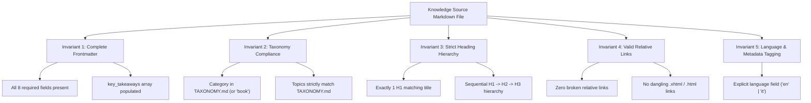

# Research Report: Markdown Corpus Audit and Normalization Invariants

**Document ID**: `docs/research/002-corpus-audit.md`  
**Author**: `icaro-rdp`  
**Date**: 2026-08-10  
**Status**: Complete / Research Specification  
**Target Module**: [`main/utils/kb_engine/`](file:///Users/icaroredepaolini/Personale/training/endurance_training/main/utils/kb_engine/) (`KBEngine` Facade & Schema Validator)  

---

## 1. Executive Summary

This research report documents a comprehensive audit of the Markdown corpus in [`Knowledge_base/`](file:///Users/icaroredepaolini/Personale/training/endurance_training/Knowledge_base/) conducted for Issue #2 (*Audit the Markdown corpus and define normalization invariants*).

The primary objective of this audit is to quantify all existing structural, metadata, taxonomy, language, and citation defects across the Knowledge Base, identify critical edge cases, and define strict **Normalization Invariants** and migration steps. Adhering to these invariants ensures that every Knowledge Source document satisfies the agreed provenance, structure, language, and citation contract without altering substantive domain meaning.

### Key Quantitative Findings
- **Corpus Scope**: 63 total Markdown files audited (60 Knowledge Source documents, 3 administrative/taxonomy files).
- **Corpus Volume**: 34,447 total lines, 624,116 words, and ~3.82 MB of formatted text across the 60 Knowledge Sources.
- **YAML Frontmatter Completeness**: **100% (60/60)** of Knowledge Source documents lack the mandatory `key_takeaways` array field defined in [`TAXONOMY.md`](file:///Users/icaroredepaolini/Personale/training/endurance_training/Knowledge_base/TAXONOMY.md). Zero YAML syntax errors were detected.
- **Taxonomy Compliance**: **5/60** documents use an invalid category (`general` instead of `book` or valid domain categories). **7/60** documents contain non-canonical topic tags (`Metrics`, `Glucose_fructose`, `General`).
- **Heading Hierarchy & Structure**: **4/5** book sources (totaling 491,138 words across 23,726 lines) contain **zero Markdown headings** (`#`, `##`, etc.), rendering them flat un-headed text streams. **1/60** document contains a hierarchy jump (H1 to H4).
- **Language Breakdown**: 59 English documents (98.3%) and 1 Italian document (1.7% — `Books/Periodizzazione dell'allenamento sportivo.md`, 151,300 words).
- **Citation Drift & Link Defects**: **6,747 broken relative links** were identified across 6 documents, primarily consisting of dangling EPUB/HTML/image conversion artifacts in translated books and missing relative directory paths in episode notes.

---

## 2. Corpus Inventory & Distribution Analysis

The Knowledge Base is partitioned into three functional subdirectories under [`Knowledge_base/`](file:///Users/icaroredepaolini/Personale/training/endurance_training/Knowledge_base/):
1. **`Articles/`**: Web articles and blog posts (e.g. *knowledgeIsWatts* series).
2. **`Episodes/`**: Structured podcast notes (e.g. *Empirical Cycling Podcast*).
3. **`Books/`**: Full-length reference books and textbooks.

In addition, 3 administrative files reside in the corpus (`Knowledge_base/TAXONOMY.md`, `Knowledge_base/INDEX.md`, and `Knowledge_base/Books/_summary/INDEX.md`).

### Table 1: Knowledge Base Corpus Inventory

| Subdirectory / Category | File Count | Line Count | Word Count | Size (KB) | % of Corpus Words | Avg Words / Doc |
|---|---|---|---|---|---|---|
| **`Articles/`** | 41 | 6,211 | 49,065 | 299.7 KB | 7.9% | 1,196 |
| **`Episodes/`** | 14 | 2,397 | 18,909 | 133.0 KB | 3.0% | 1,350 |
| **`Books/`** | 5 | 25,839 | 556,142 | 3,385.3 KB | 89.1% | 111,228 |
| **Total Sources** | **60** | **34,447** | **624,116** | **3,818.0 KB** | **100.0%** | **10,402** |
| Administrative (`INDEX.md`, etc.) | 3 | 1,027 | 4,024 | 26.5 KB | — | 1,341 |
| **Grand Total** | **63** | **35,474** | **628,140** | **3,844.5 KB** | — | — |

> **Key Observation**: The 5 reference books account for **89.1% of all words** in the Knowledge Base while representing only 8.3% of the document count. The extreme skew between concise articles (~1,200 words) and monolithic books (~111,000 words) requires distinct structural normalization strategies.

---

## 3. Defect Class Quantifications

### 3.1 YAML Frontmatter Validity & Completeness

Every document was evaluated against the required frontmatter schema specified in [`TAXONOMY.md`](file:///Users/icaroredepaolini/Personale/training/endurance_training/Knowledge_base/TAXONOMY.md):
```yaml
---
title: "Document Title"
category: "metrics | hiit | zone2 | strength | nutrition | physiology | periodization | book"
topics:
  - "Topic 1"
  - "Topic 2"
source: "Origin URL, Podcast Name, or Book Title"
author: "Author / Speaker"
date: "YYYY-MM-DD"
summary: "1-2 sentence executive summary."
key_takeaways:
  - "Key point 1"
  - "Key point 2"
---
```

### Table 2: Frontmatter Audit Defect Rates

| Frontmatter Metric | Defect Count | Defect Rate | Affected Documents |
|---|---|---|---|
| **Missing Frontmatter Fence (`---`)** | 0 | 0.0% | None |
| **YAML Syntax Errors** | 0 | 0.0% | None |
| **Missing `key_takeaways` Field** | 60 | **100.0%** | All 60 Knowledge Sources |
| **Missing `summary` Field** | 0 | 0.0% | None |
| **Missing `title`, `author`, `date`** | 0 | 0.0% | None |
| **Extra / Non-Standard Fields** | 0 | 0.0% | None |

> **Primary Defect**: Across all 60 documents, `title`, `category`, `topics`, `source`, `author`, `date`, and `summary` are consistently present, but **100% of documents omit `key_takeaways`**.

---

### 3.2 Taxonomy Compliance

Document categories and topics were checked against the canonical vocabulary in [`TAXONOMY.md`](file:///Users/icaroredepaolini/Personale/training/endurance_training/Knowledge_base/TAXONOMY.md).

#### Category Audit
- Valid Taxonomy Categories: `metrics` (12), `hiit` (8), `zone2` (3), `strength` (5), `nutrition` (6), `physiology` (2), `periodization` (19).
- Invalid Category (`general`): **5 documents** (all 5 book sources: `Books/Injury-Free Running - Your Illustrated Guide.md`, `Books/Norwegian Singles Method Subthreshold.md`, `Books/Periodizzazione dell'allenamento sportivo.md`, `Books/Training and Racing with a Power Meter.md`, `Books/Training for the Uphill Athlete.md`).
- *Note*: [`TAXONOMY.md`](file:///Users/icaroredepaolini/Personale/training/endurance_training/Knowledge_base/TAXONOMY.md#L80) allows `book` as a valid category string, but the book files currently set `category: general`.

#### Topic Tag Audit
7 documents contain non-canonical topic strings not listed in [`TAXONOMY.md`](file:///Users/icaroredepaolini/Personale/training/endurance_training/Knowledge_base/TAXONOMY.md):
1. **`Metrics`** (Capitalized casing error; canonical topics are `FTP`, `CP`, `Power_vs_HR`, etc.):
   - `Articles/knowledgeIsWatts/metrics/metrics-flat-vs-uphill-power-output.md`
   - `Articles/knowledgeIsWatts/metrics/metrics-visualizing-performance-progress.md`
2. **`Glucose_fructose`** (Unlisted tag; canonical topic is `Carbohydrate_ratio`):
   - `Articles/knowledgeIsWatts/nutrition/nutrition-glucose-fructose-ratio.md`
   - `Episodes/Empirical_cycling_podcast/training/threshold/FTP_workout_2x20.md`
3. **`General`** (Generic filler tag):
   - `Books/Injury-Free Running - Your Illustrated Guide.md`
   - `Books/Periodizzazione dell'allenamento sportivo.md`
   - `Books/Training for the Uphill Athlete.md`

---

### 3.3 Structural & Heading Hierarchy Audit

### Table 3: Heading Hierarchy Distribution

| Structural Metric | Document Count | Description / Affected Files |
|---|---|---|
| **Exactly 1 H1 (`#`)** | 56 | 41 Articles, 14 Episodes, 1 Book (`Norwegian Singles Method`) |
| **Zero H1 (`#`) Headings** | 4 | 4 Books (`Injury-Free Running`, `Periodizzazione`, `Training and Racing`, `Training for Uphill Athlete`) |
| **Multiple (>1) H1 Headings** | 0 | None |
| **Zero Headings at All** | 4 | Same 4 book files (23,726 lines without any `#`, `##`, `###` headings) |
| **Hierarchy Level Jumps** | 1 | `Books/Norwegian Singles Method Subthreshold.md` (Jumps H1 $\rightarrow$ H4 at L25) |

> **Critical Impact**: The 4 un-headed book files contain **491,138 words** of un-structured prose. Semantic chunking algorithms relying on Markdown section boundaries fail when encountering 100,000+ word un-headed files.

---

### 3.4 Language Breakdown

- **English (`en`)**: 59 documents (98.3% of corpus, 472,816 words).
- **Italian (`it`)**: 1 document (1.7% of corpus, 151,300 words — `Books/Periodizzazione dell'allenamento sportivo.md` by Tudor Bompa & Carlo Buzzichelli).

> **Retrieval Requirement**: Semantic and hybrid retrieval (`search_knowledge_base`) must support cross-lingual search across English queries and Italian evidence passages, requiring language tags in document metadata.

---

### 3.5 Citation Drift & Broken Link Analysis

A total of **6,809 relative links** were parsed across the corpus. Of these, **6,747 broken relative links** were identified across 6 documents.

### Table 4: Citation Drift & Link Defect Summary

| Defect Class | File | Broken Links | Root Cause Analysis |
|---|---|---|---|
| **Missing Relative Paths** | `Episodes/.../recovery/stimulus_recovery.md` | 2 | Links to `FTP_workout_2x20.md` and `VO2_training.md` without folder paths (`../threshold/`, `../vo2/`). |
| **Dangling EPUB HTML Links** | `Books/Injury-Free Running...md` | 351 | Unconverted EPUB links (`06-ch01.xhtml`, `images/cover.jpg`) from original e-book conversion. |
| **Dangling EPUB HTML Links** | `Books/Norwegian Singles Method...md` | 70 | Unconverted EPUB links (`c56.xhtml#a4VV`, `image_rsrc51C.jpg`). |
| **Dangling HTML Page Links** | `Books/Periodizzazione...md` | 762 | Unconverted EPUB links (`../Text/part0005.html#page_9`, `../Images/00001.jpeg`). |
| **Dangling HTML Chapter Links** | `Books/Training and Racing...md` | 3,734 | Unconverted HTML links (`Chapter01.html#ch1`, `../images/f303.jpg`). |
| **Dangling HTML Section Links** | `Books/Training for Uphill Athlete.md` | 1,820 | Unconverted HTML links (`part0004.html#3Q280...`, `../images/00001.jpeg`). |
| **Absolute Local URIs** | `Books/_summary/INDEX.md` | 5 | Hardcoded `file:///Users/icaroredepaolini/...` absolute paths instead of relative repo paths. |
| **Total** | — | **6,747** | — |

---

## 4. Edge Cases & Representative Examples

### Edge Case 1: Monolithic Flat Un-Headed Books
- **File**: [`Books/Training and Racing with a Power Meter.md`](file:///Users/icaroredepaolini/Personale/training/endurance_training/Knowledge_base/Books/Training%20and%20Racing%20with%20a%20Power%20Meter.md)
- **Characteristics**: 5,231 lines, 141,859 words, 0 Markdown headings.
- **Problem**: Raw EPUB HTML tags were stripped, but section headers were left as plain bold text without Markdown `#` syntax.
- **Remediation**: Parse chapter titles (e.g. `Chapter 1: Why Train with Power?`) and convert to H2 (`##`) and H3 (`###`) Markdown headings.

### Edge Case 2: Italian Monolithic Source
- **File**: [`Books/Periodizzazione dell'allenamento sportivo.md`](file:///Users/icaroredepaolini/Personale/training/endurance_training/Knowledge_base/Books/Periodizzazione%20dell'allenamento%20sportivo.md)
- **Characteristics**: 7,713 lines, 151,300 words in Italian, 0 Markdown headings, 762 broken HTML links.
- **Problem**: Monolithic Italian text with raw page/part anchor links (`../Text/part0005.html`).
- **Remediation**: Add H2 chapter headings in Italian, inject `language: "it"` frontmatter, and strip dangling HTML anchor tags.

### Edge Case 3: Heading Level Skip
- **File**: [`Books/Norwegian Singles Method Subthreshold.md`](file:///Users/icaroredepaolini/Personale/training/endurance_training/Knowledge_base/Books/Norwegian%20Singles%20Method%20Subthreshold.md#L25)
- **Characteristics**: Line 25 jumps from H1 (`# Title`) directly to H4 (`#### Acknowledgments and Thanks`).
- **Remediation**: Adjust heading levels to sequential order (H1 $\rightarrow$ H2 $\rightarrow$ H3).

### Edge Case 4: Topic Casing and Synonym Drift
- **File**: [`Articles/knowledgeIsWatts/metrics/metrics-flat-vs-uphill-power-output.md`](file:///Users/icaroredepaolini/Personale/training/endurance_training/Knowledge_base/Articles/knowledgeIsWatts/metrics/metrics-flat-vs-uphill-power-output.md)
- **Characteristics**: Uses `topics: ["Metrics"]` instead of canonical taxonomy topics `Power_vs_HR` or `FTP`.
- **Remediation**: Normalize topic array against canonical topics in [`TAXONOMY.md`](file:///Users/icaroredepaolini/Personale/training/endurance_training/Knowledge_base/TAXONOMY.md).

---

## 5. Proposed Normalization Invariants

To guarantee search consistency, citation stability, and validator zero-warning execution, all files under `Knowledge_base/` MUST satisfy the following 5 **Normalization Invariants**:



### Invariant 1: Mandatory Frontmatter Schema Completeness
Every Knowledge Source document MUST begin with valid YAML frontmatter bounded by `---` fences, containing all 8 required fields:
1. `title`: String matching the document H1 heading.
2. `category`: String matching one of `metrics`, `hiit`, `zone2`, `strength`, `nutrition`, `physiology`, `periodization`, or `book`.
3. `topics`: Non-empty list of canonical topic strings from [`TAXONOMY.md`](file:///Users/icaroredepaolini/Personale/training/endurance_training/Knowledge_base/TAXONOMY.md).
4. `source`: Origin string (podcast episode, book title, or article URL).
5. `author`: Author or speaker name(s).
6. `date`: ISO date string (`YYYY-MM-DD`).
7. `summary`: Executive summary (1-3 sentences).
8. `key_takeaways`: Non-empty YAML list of 2-5 concise bullet points summarizing actionable training takeaways.

### Invariant 2: Taxonomy & Tag Canonicalization
- No non-standard category strings (e.g. `general` $\rightarrow$ replace with `book` or domain category).
- Topic strings must strictly match topic tags defined in [`TAXONOMY.md`](file:///Users/icaroredepaolini/Personale/training/endurance_training/Knowledge_base/TAXONOMY.md). Casing aliases (`Metrics` $\rightarrow$ `FTP`/`Power_vs_HR`) and synonyms (`Glucose_fructose` $\rightarrow$ `Carbohydrate_ratio`) are forbidden.

### Invariant 3: Sequential Heading Hierarchy
- Every document MUST contain exactly **one H1 (`#`) heading** at the top of the body, matching the `title` frontmatter attribute.
- All subsequent headings MUST follow sequential nesting: H1 $\rightarrow$ H2 (Chapters/Sections) $\rightarrow$ H3 (Subsections) $\rightarrow$ H4. Level jumps (e.g. H1 $\rightarrow$ H3 or H1 $\rightarrow$ H4) are forbidden.
- Long documents (>2,000 words) MUST be partitioned with H2/H3 headings to ensure citation-stable chunking.

### Invariant 4: Citation & Relative Link Integrity
- All relative Markdown links (`[text](relpath.md#L...)`) MUST resolve to existing files and valid anchors in `Knowledge_base/`.
- Cross-folder references MUST specify complete relative directory paths (e.g. `../threshold/FTP_workout_2x20.md`).
- Dangling EPUB/HTML anchor tags (`.xhtml`, `.html`) and un-committed image references (`images/cover.jpg`) MUST be stripped or replaced with plain text references.
- Index files MUST use relative repository paths, not local absolute file URIs (`file:///Users/...`).

### Invariant 5: Explicit Language Metadata
- Frontmatter MUST include a `language` field (`"en"` or `"it"`). Default is `"en"`.
- Multilingual retrieval indices MUST inspect `language` to optimize tokenization and embedding models.

---

## 6. Migration Strategy & Implementation Roadmap

The normalization of the corpus will be executed in three automated migration steps:

### Step 1: Frontmatter Standardization & Takeaways Population
- Update [`main/utils/kb_engine/frontmatter.py`](file:///Users/icaroredepaolini/Personale/training/endurance_training/main/utils/kb_engine/frontmatter.py) to support key takeaways parsing and auto-populating.
- Run a standardization script to populate `key_takeaways` across all 60 documents using executive summaries and LLM synthesis.
- Replace `category: general` with `category: book` for the 5 book files.
- Re-map non-standard topics (`Metrics` $\rightarrow$ `Power_vs_HR`, `Glucose_fructose` $\rightarrow$ `Carbohydrate_ratio`).

### Step 2: Book Structure Injection & Link Cleanup
- Process the 4 flat un-headed book files (`Training and Racing`, `Training for Uphill Athlete`, `Periodizzazione`, `Injury-Free Running`) to convert plain-text chapter headers into H2 (`##`) Markdown headings.
- Fix heading level skip in `Norwegian Singles Method` (H4 $\rightarrow$ H2).
- Strip dangling EPUB `.xhtml`/`.html` links across all 5 book files.
- Repair relative directory link paths in `stimulus_recovery.md` and `INDEX.md`.

### Step 3: Diagnostic Enforcements in `main/cli.py validate`
- Update `main/utils/kb_engine/validator.py` to enforce all 5 Normalization Invariants during `python3 main/cli.py validate`.
- Assert 0 errors and 0 warnings on clean validation runs.

---

## 7. References & Related Documents

- [`Knowledge_base/TAXONOMY.md`](file:///Users/icaroredepaolini/Personale/training/endurance_training/Knowledge_base/TAXONOMY.md) — Canonical categories, topics, and frontmatter guidelines.
- [`Knowledge_base/INDEX.md`](file:///Users/icaroredepaolini/Personale/training/endurance_training/Knowledge_base/INDEX.md) — Master index of all Knowledge Sources.
- [`CONTEXT.md`](file:///Users/icaroredepaolini/Personale/training/endurance_training/CONTEXT.md) — Knowledge Base architecture and glossary.
- [`docs/agents/issue-tracker.md`](file:///Users/icaroredepaolini/Personale/training/endurance_training/docs/agents/issue-tracker.md) — GitHub issue tracking conventions.
