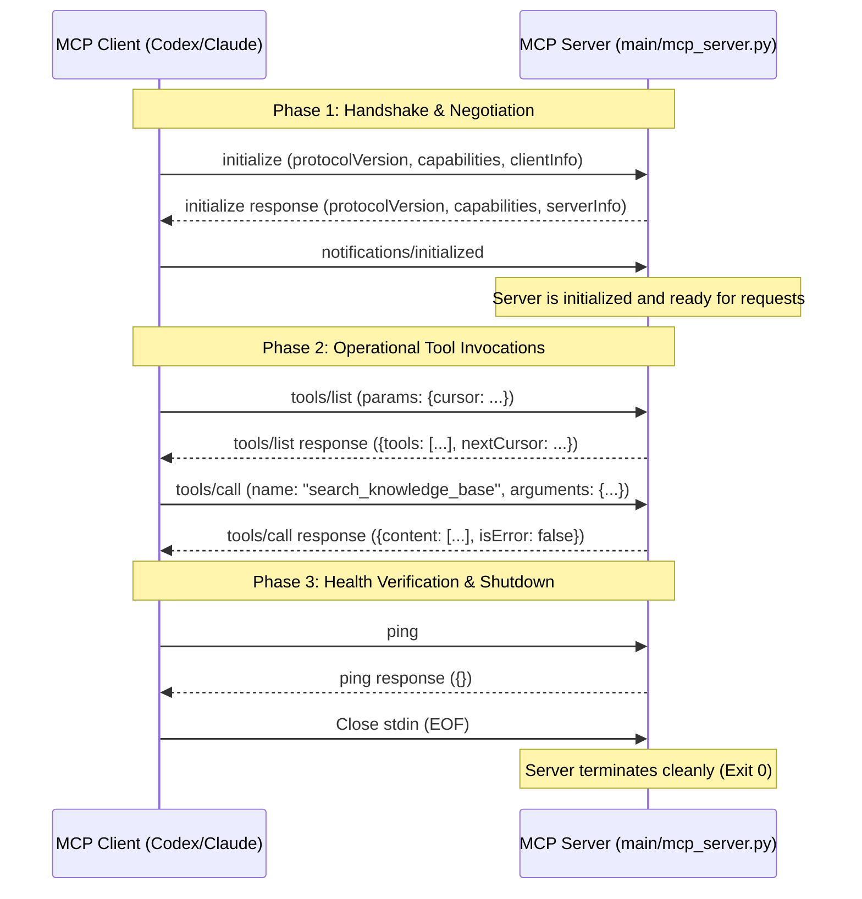

# Research Report: MCP Specification Conformance & Local-Server Architecture

**Document ID**: `docs/research/004-mcp-conformance.md`  
**Author**: `icaro-rdp`  
**Date**: 2026-08-10  
**Status**: Complete / Research Specification  
**Target Module**: [`main/mcp_server.py`](file:///Users/icaroredepaolini/Personale/training/endurance_training/main/mcp_server.py) (`KBEngine` MCP Adapter)  

---

## 1. Executive Summary

This research specification establishes the authoritative protocol conformance standards and local-server architecture guidelines for the **Endurance Training Knowledge Base** Model Context Protocol (MCP) server.

The MCP server acts as an agentic interface between external LLM clients (such as Codex client, Claude Desktop, Cursor, and AGY) and the core [`KBEngine`](file:///Users/icaroredepaolini/Personale/training/endurance_training/main/utils/kb_engine.py) domain module. This report evaluates the official Model Context Protocol specification (2024-11-05 schema version), Python SDK design patterns, standard input/output (`stdio`) transport framing requirements, full protocol lifecycle management, structured error handling, path containment boundaries, pagination standards, and Codex client integration configurations.

---

## 2. Protocol Requirements vs. Optional Application Design Choices

To build a robust, maintainable local MCP server, we must strictly distinguish between **Protocol Requirements** (mandated by the official MCP Specification and JSON-RPC 2.0 standard) and **Application-Level Design Choices** (tailored to our endurance training domain and repository architecture).

| Architectural Dimension | Strict Protocol Requirement (MCP Spec / JSON-RPC 2.0) | Optional Application-Level Design Choice (Endurance KB) |
|---|---|---|
| **Transport Stream** | UTF-8 encoded JSON-RPC 2.0 over `stdin`/`stdout`. `stdout` strictly reserved for raw JSON-RPC messages; `stderr` reserved for server diagnostic logs. | Server process invocation via virtualenv Python interpreter (`.venv/bin/python3 main/mcp_server.py`). |
| **Message Framing** | Line-delimited JSON (`\n` or `\r\n`). Zero stray `print()` output or unformatted text on `stdout`. | Asynchronous stdio event loop using official Python `mcp.server.stdio` transport. |
| **Protocol Lifecycle** | Handshake sequence: `initialize` request → server response → `notifications/initialized`. Ping request handling. | Automatic initialization of [`KBEngine`](file:///Users/icaroredepaolini/Personale/training/endurance_training/main/utils/kb_engine.py) facade upon server process launch. |
| **Tool Specification** | `tools/list` returns schema array (`name`, `description`, `inputSchema` conforming to JSON Schema draft-07/2020-12). | Schema definitions auto-generated via Pydantic models in Python SDK (`FastMCP`). |
| **Tool Execution Output** | `tools/call` returns `{ "content": [...], "isError": bool }`. | Content formatted as structured LLM-friendly Markdown with exact source line citations (`file:///...#L..-L..`). |
| **Error Handling** | Reserved JSON-RPC error codes (`-32600` to `-32603`) for protocol faults; `isError: true` in result payload for tool runtime failures. | Domain error classifications (`StaleIndexError`, `PathContainmentError`, `TaxonomyValidationError`). |
| **Pagination** | Opaque cursor string (`cursor` in params, `nextCursor` in response) for listing endpoints. | Page size defaults (`top_k=5` for search, chunked index delivery). |
| **File Containment Security** | Process boundary isolation and strict argument validation. | Strict path containment within [`Knowledge_base/`](file:///Users/icaroredepaolini/Personale/training/endurance_training/Knowledge_base/) root using resolved path validation. |

---

## 3. Official MCP Specification & Stdio Transport Analysis

### 3.1 JSON-RPC 2.0 Protocol & Stdio Framing
The MCP `stdio` transport standardizes communication over process input/output streams:
- **`stdin` (Client → Server)**: Receives incoming JSON-RPC requests, responses, and notifications.
- **`stdout` (Server → Client)**: Transmits outgoing JSON-RPC responses, requests, and notifications.
- **`stderr` (Server → Diagnostic Log)**: Dedicated stream for internal server logs, error tracebacks, and operational metrics.

> **CRITICAL PROTOCOL RULE**: Writing arbitrary text or standard logging directly to `stdout` corrupts JSON-RPC stream parsing in client adapters (Codex, Claude Desktop, Cursor), causing immediate connection termination. All internal application logs MUST be directed to `stderr` or python's `logging` module configured with stream `sys.stderr`.

### 3.2 Protocol Lifecycle Sequence
The MCP lifecycle mandates three distinct phases:



1. **Initialization Handshake**:
   - Client sends `initialize` request with client protocol version (e.g. `"2024-11-05"`), client capabilities, and metadata.
   - Server validates protocol version, responds with agreed `protocolVersion`, server capabilities (`{"tools": {}}`), and `serverInfo`.
2. **Initialized Notification**:
   - Client emits `notifications/initialized` notification. The server MUST NOT process regular tool calls or business logic prior to receiving this notification.
3. **Operational Invocation Phase**:
   - Client calls `tools/list` to discover schemas and `tools/call` to execute domain tools.
4. **Shutdown Phase**:
   - Closing `stdin` (EOF) signals process shutdown. The server must cleanup resources and terminate cleanly with code 0.

---

## 4. Python SDK Architecture: FastMCP vs. Low-Level Server

When building Python-based MCP servers, developers choose between `FastMCP` (High-Level Decorator API) and `mcp.server.lowlevel.Server`.

### 4.1 Comparison Matrix

| Architectural Axis | `FastMCP` (`mcp.server.fastmcp`) | Low-Level `Server` (`mcp.server.lowlevel`) |
|---|---|---|
| **Abstraction Level** | High (Decorator-driven, FastAPI/Flask style) | Low (Explicit request registration & dispatcher) |
| **Schema Generation** | Automatic from type annotations & Pydantic models | Manual JSON Schema dictionary construction |
| **Error Handling** | Automatic translation of uncaught errors to `isError: true` | Manual `CallToolResult` formatting for every branch |
| **Boilerplate Code** | ~30 lines of declarative code | ~150+ lines of raw JSON-RPC handling |
| **Spec Conformance** | 100% compliant lifecycle and stdio framing out of the box | Requires custom lifecycle negotiation & framing logic |
| **Recommendation** | **PRIMARY STANDARD** (Adopt for `mcp_server.py`) | Anti-pattern for standard tool servers |

### 4.2 Recommended Python SDK Implementation (`FastMCP`)

```python
from mcp.server.fastmcp import FastMCP
from pydantic import BaseModel, Field
from main.utils.kb_engine import KBEngine

mcp = FastMCP("endurance-knowledge-base")
engine = KBEngine()

class SearchInput(BaseModel):
    query: str = Field(..., description="Natural language search query")
    category: str | None = Field(None, description="Optional category filter (e.g. hiit, zone2, metrics)")
    topic: str | None = Field(None, description="Optional topic tag (e.g. VO2max, FTP)")
    top_k: int = Field(5, ge=1, le=20, description="Number of top results to return")

@mcp.tool()
async def search_knowledge_base(params: SearchInput) -> str:
    """Perform full-text hybrid search across endurance training articles, podcasts, and books."""
    results = engine.search(
        query=params.query,
        category=params.category,
        topic=params.topic,
        top_k=params.top_k
    )
    return engine.format_llm_context(results)
```

---

## 5. Structured Error Handling & Safety Boundaries

### 5.1 Protocol Errors vs. Tool Execution Failures
A critical distinction in MCP spec conformance is proper error categorization:

- **JSON-RPC Protocol Errors** (`code`: integer):
  - `-32700`: Parse error (invalid JSON).
  - `-32600`: Invalid Request (malformed JSON-RPC header).
  - `-32601`: Method Not Found (unknown method name).
  - `-32602`: Invalid Params (arguments fail JSON schema validation).
  - `-32603`: Internal Error (uncaught server crash/exception).

- **Tool Execution Failures** (`isError: true` in result payload):
  - Returned when arguments are valid JSON-RPC, but domain execution cannot fulfill the request (e.g. search returned zero results, document path missing, index rebuild required).
  - Example payload:
    ```json
    {
      "jsonrpc": "2.0",
      "id": 42,
      "result": {
        "content": [
          {
            "type": "text",
            "text": "Error: Document 'Articles/invalid.md' not found in Knowledge Base."
          }
        ],
        "isError": true
      }
    }
    ```

### 5.2 Specific Failure Scenarios & Security Controls

#### Scenario 1: Stale or Missing FTS5 Search Index
- **Symptom**: SQLite index file `.kb_index.sqlite` is missing or out of sync with filesystem changes.
- **Handling Protocol**:
  - `KBEngine` checks index freshness against document modification timestamps.
  - If missing or stale, `KBEngine` automatically triggers transparent index rebuild or returns `isError: true` prompting the client to run `build_index`.

#### Scenario 2: Path Containment & Traversal Boundaries
- **Symptom**: Client sends path arguments escaping the corpus root (e.g. `../../etc/passwd` or `/System/...`).
- **Security Requirement**: Enforce absolute path containment inside [`Knowledge_base/`](file:///Users/icaroredepaolini/Personale/training/endurance_training/Knowledge_base/).
- **Implementation Pattern**:
  ```python
  def safe_resolve_kb_path(rel_path: str, kb_root: Path) -> Path:
      clean_rel = rel_path.lstrip("/")
      target_path = (kb_root / clean_rel).resolve()
      kb_root_resolved = kb_root.resolve()
      
      if not target_path.is_relative_to(kb_root_resolved):
          raise PermissionError(
              f"Path containment violation: '{rel_path}' resolves outside Knowledge Base root '{kb_root_resolved}'."
          )
      return target_path
  ```

#### Scenario 3: Context Payload Size Bounding
- **Symptom**: Large document retrieval overwhelms LLM context limits.
- **Mitigation**:
  - Cap search results (`top_k` max parameter = 20).
  - Truncate or paginate full document responses when exceeding max token length.

---

## 6. Pagination Standards

For listing tools (`tools/list`), resources (`resources/list`), or prompts (`prompts/list`), MCP defines cursor-based pagination:

```json
{
  "jsonrpc": "2.0",
  "id": 2,
  "result": {
    "tools": [ ... ],
    "nextCursor": "eyJvZmZzZXQiOiAxMH0="
  }
}
```

For domain-specific search results inside `search_knowledge_base`:
- Support optional `page` or `offset` parameters in tool arguments.
- Include structured result headers (e.g., `Showing results 1-5 of 24`).

---

## 7. Codex Client & LLM Integration Guidelines

To integrate the Endurance Training KB MCP server into Codex / Claude Desktop / Cursor clients, register the stdio process definition in the client configuration file.

### 7.1 Client Configuration snippet (`mcpServers`)

```json
{
  "mcpServers": {
    "endurance-kb": {
      "command": "/Users/icaroredepaolini/Personale/training/endurance_training/.venv/bin/python3",
      "args": [
        "/Users/icaroredepaolini/Personale/training/endurance_training/main/mcp_server.py"
      ],
      "cwd": "/Users/icaroredepaolini/Personale/training/endurance_training",
      "env": {
        "PYTHONUNBUFFERED": "1"
      }
    }
  }
}
```

### 7.2 Verification & Inspection Workflow
1. **MCP Inspector Verification**:
   - Run standard inspector tool to interactive verify stdio framing, tool discovery, and schema execution:
     ```bash
     npx @modelcontextprotocol/inspector .venv/bin/python3 main/mcp_server.py
     ```
2. **Automated Unit Testing**:
   - Verify tool schemas and handlers using `pytest`.
   - Test path containment checks and error response formats.

---

## 8. Summary of Architectural Recommendations for Issue #4

1. **Refactor `main/mcp_server.py` to Official SDK**: Transition from raw custom stdio JSON-RPC loop to official Python `mcp` package using `FastMCP`.
2. **Structured Pydantic Schemas**: Standardize parameter validation and tool description extraction across all tools (`search_knowledge_base`, `get_kb_index`, `get_document`, `validate_kb`).
3. **Security Boundary Enforcement**: Implement strict `is_relative_to` checks for `get_document` to prevent path traversal outside `Knowledge_base/`.
4. **Clean Stdio Hygiene**: Direct all logging and diagnostic output to `stderr`.

---
